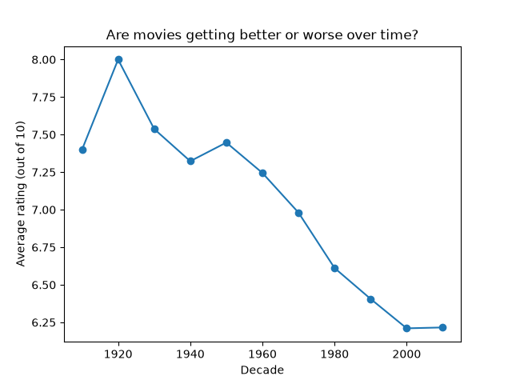

# My Python Capstone Project

Are movies getting worse or better over time?

## 1. What problem are we solving?

People love to say 'movies used to be better back then.' But is that actually true? Most people argue about it without checking. In this project I looked at ratings for thousands of movies to see whether audiences really rate newer films lower than older ones.

## 2. What tools did I use?

I used Python for this project along with two libraries: pandas to load and work with the data and matplotlib to draw the chart.

The data came from the TMDB 5000 Movie Dataset on Kaggle, which has details on about 4,800 movies including their release dates and their audience ratings.

To get from raw data to an answer, I did 5 things:

1. Converted each movie's release date into a year.

2. Removed movies with fewer than 50 votes, because a rating from a handful of people isn't reliable. That left me with 3,652 movies.

3. Grouped the movies into decades.

4. Calculated the average rating and the number of movies in each decade. I tracked the count so I could tell which averages were trustworthy.

5. Plotted the average ratings as a line chart to show the trend over time.

## 3. What did I find?

This data supports the idea that older movies are rated higher. Average ratings fell from about 7.2 in the 1960s to 6.6 in the 1980s and 6.2 in the 2000s, a drop of roughly one full point over 40 years. But the decline has flattened out: the 2000s (6.21) and the 2010s (6.22) are almost identical, so movies aren't still getting worse.

I also noticed a problem with the data itself. The 1910s and 1920s have only one movie each, and the 1930s have just eight, so their high averages don't tell us much.

A likely reason older films rate so well is that the old movies people still watch and rate today are probably the ones that survived because they were good.

So the belief that 'movies used to be better' may come partly from remembering only the best of the past.

## 4. Who benefits?

This project gives a real answer to a debate people usually settle on opinion alone. The answer is that older films do have higher average ratings, but the gap has stopped growing, and part of it is probably because only the best old movies are still being rated today.

It is useful in a few ways:

**Viewers** get a reason to try highly rated older films, and can see that newer movies aren't getting worse.

**Streaming platforms** deciding which older titles to license or promote can see that classic films tend to earn strong ratings.

**Anyone using ratings data** learns to check how many movies sit behind an average before trusting it. That caution applies well beyond movies.